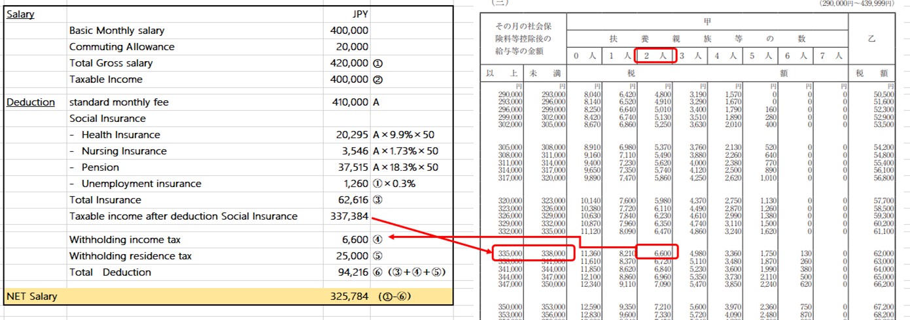
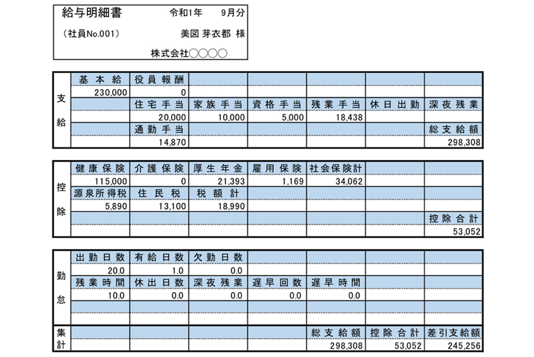

# Nómina en Japón

***por Jesús Bautista***

## Información general

Japón es un estado de Asia oriental en el borde occidental del Océano Pacífico. Comprende cuatro islas principales: Honshu, Hokkaido, Kyushu y Shikoku, junto con miles de masas de tierra más pequeñas. El antiguo Japón se desarrolló como un imperio, pero fue gobernado por señores feudales, conocidos como shogunes, y permaneció relativamente aislado del resto del mundo hasta mediados del siglo XIX, después de lo cual comenzó a aventurarse más allá de sus fronteras, tanto cultural como políticamente. Hoy, como miembro de la ONU y otras organizaciones importantes, Japón es un país moderno y altamente desarrollado, y desempeña un importante papel regional y global. Los niveles de vida de Japón se encuentran entre los más altos del mundo: sus ciudadanos disfrutan de la esperanza de vida más alta y la tasa de mortalidad infantil más baja. Gran parte de Japón es montañoso o muy boscoso,lo que significa que los centros urbanos se agrupan alrededor de las costas de las islas. El país es templado, pero las condiciones climáticas pueden variar mucho durante todo el año: desde inviernos severos con fuertes nevadas hasta veranos sofocantes y húmedos.

## Nómina en Japón

La moneda oficial es el yen japonés (¥). Japón reconoce legalmente a bitcoin como un método legal de pago. Sin embargo, la Agencia de Servicios Financieros de Japón considera que el bitcoin es un activo o una mercancía más que una moneda legal.

Hay cuatro estructuras comerciales más comunes en Japón. Configurar su nómina dependerá del tipo de estructura corporativa que se utilice:

- *Godo-Kaisha* : funciona de manera similar a la configuración de una LLC estadounidense (o "compañía de responsabilidad limitada")
- *Goshi-Kaisha* - una compañía de "sociedad limitada"
- *Gomei-Kaisha* - una "compañía de sociedad general"
- *Kabushiki-Kaisha* : la estructura empresarial más popular. Es la versión japonesa de la incorporación.

Es importante que los empleadores en Japón observen todas las reglas y regulaciones de nómina relevantes y cumplan con las obligaciones de retención. En términos generales, el sistema de nómina de Japón implica dos impuestos principales: la contribución del Seguro Social, que cubre el seguro de salud del gobierno, las pensiones y el plan de enfermería, y la contribución del Seguro Laboral, que cubre el seguro de accidentes y desempleo. El impuesto sobre la renta personal también es calculado y retenido por los empleadores.

Los informes de nómina en Japón deben mantenerse durante al menos 40 años, mientras que los recibos de sueldo pueden emitirse a los empleados en línea.

### Impuesto sobre la renta y seguridad social en Japón

#### Impuesto sobre la renta

Hay dos impuestos principales: el Impuesto Nacional sobre la Renta (equivalente al Impuesto Federal para los EE. UU.) Y el Impuesto Habitante (también conocido como Impuesto de residencia). En Japón, los impuestos sobre la renta del salario se calculan y retienen del salario del empleado.

El año fiscal se extiende del 1 de enero al 31 de diciembre. Las autoridades fiscales japonesas no permiten extensiones de tiempo para presentar la declaración de impuestos. La penalización se calcula caso por caso. En general, si la declaración de impuestos se presenta tarde, se aplica una multa del 5% (o posiblemente del 15% al 20%) inmediatamente sobre el saldo de impuestos adeudado. Además, el interés por el retraso en el pago del impuesto se evalúa en 4.3% anual durante los primeros dos meses y aumenta a 14.6% anual a partir de entonces.

##### Impuesto Nacional sobre la Renta

El impuesto sobre la renta se aplica a tasas progresivas, del 5% al 45%. Los ingresos imponibles consisten en ingresos por empleo, ingresos por jubilación, ingresos por alquileres de bienes inmuebles, ingresos forestales, ingresos por negocios, ingresos por intereses, ingresos por dividendos, ganancias de capital de bienes inmuebles, ganancias de capital de valores, ganancias de capital ordinarias, ingresos ocasionales e ingresos varios.

En general, un no residente es responsable del impuesto sobre la renta nacional de Japón a una tasa fija del 20,42% de su fuente de ingresos japonesa.

| Salario anual         | **Porcentaje del impuesto** |
| --------------------- | --------------------------- |
| 0 - 1,950,000         | 5%                          |
| 1,950,001 - 3,300,000 | 10%                         |
| 3,300,001－6,950,000  | 20%                         |
| 6,950,001－9,000,000  | 23%                         |
| 9,000,001－18,000,000 | 33%                         |
| 40,000,001 +          | 40%                         |

##### Impuesto de residencia

Los que viven en Japón durante, en principio, más de 1 año a partir del 1 de enero están obligados a pagar el impuesto de los habitantes a los gobiernos de las prefecturas y los gobiernos municipales de Japón. La tasa impositiva agregada de los habitantes locales es del 10%. El monto del impuesto a los habitantes se calcula en función de los ingresos del año anterior. Por lo tanto, para un nuevo expatriado en Japón, no será hasta 1 año que se impondrá el impuesto a los habitantes.

#### Seguro social

El pago del Seguro Social vence al final de cada mes. La compañía recibirá una notificación del monto adeudado. Tanto el empleador como el empleado (aproximadamente una división de 50/50 en el costo) pagan las primas de los beneficios sociales. La parte del empleado se tomará directamente del Salario bruto mensual junto con otras deducciones legales, como el Impuesto nacional sobre la renta y el Impuesto a los habitantes. Para la presentación tardía y el pago de la Seguridad Social, la tasa de interés es del 4,3% durante los primeros tres meses y del 14,6% durante los tres meses posteriores a la fecha de vencimiento.

La ley de seguridad social requiere contribuciones a los sistemas nacionales de seguro social y laboral con respecto a los empleados en Japón. Las categorías de seguridad social incluyen salud, bienestar y seguro laboral.

Las contribuciones de empleadores y empleados generalmente se alinean con la excepción del seguro laboral.

Dos programas ofrecen seguro de salud: el seguro nacional de salud y el seguro de salud de los empleados.

- Seguridad social de los empleados : la tasa es del 14,7% para los empleados que cumplen 40 años.

  El desglose general es el siguiente:

  - Seguro de asistencia social: 9.150% limitado a ¥ 56,730 por mes
  - Seguro de salud: 4.950% limitado a ¥ 68,805 por mes
  - Seguro de empleo: 0.6% sin límite

- **Seguridad social del empleador**: la seguridad social del empleador tiene varios componentes y puede variar según el empleador y / o la edad del empleado. La tasa es del 15.485% para empleados menores de 40 años.

  El desglose general es el siguiente:

  - Seguro de asistencia social: 9.150% limitado a ¥ 56,730 por mes;
  - Seguro de salud: 5.735% tope a ¥ 79,716 por mes;
  - Seguro de empleo: 0.6% sin límite

> En cuanto a los seguros laborales, un director no puede solicitar los seguros a menos que él / ella trabaje como empleado simultáneamente bajo el control de la alta dirección. En Japón, un director no es considerado como un empleado por ley y se pueden aplicar diferentes reglas a menos que se indique lo contrario.

### Otras consideranciones

#### Fecha de pago de nómina

Nómina en Japón se suele pagar el 25 del mes aunque las empresas pueden decidir libremente el día de pago a los empleados.

#### El sueldo en las ofertas de empleo

La mayoría de los salarios que figuran en los listados de trabajo y sitios de trabajo en Japón mostrarán el "valor nominal". En otras palabras, el ingreso neto que recibirá como salario será menor que la cantidad indicada allí.

#### Dias festivos

Los dias festivos en Japón son un conjunto de fiestas reguladas por ley: La Ley de fiestas nacionales ( 国民の祝日に関する法律 , Kokumin no shukujitsu ni kansuru hōritsu ) del 1948 establece las fechas oficiales. Una provisión de la ley manda que cuando una festividad nacional coincida en domingo, el próximo día laborable se convertirá en un día festivo, conocida como ( 振替休日 , furikae kyūjitsu , lit. "suplente de vacaciones") . Adicionalmente, cualquier día que caiga en medio de otras dos festividades nacionales también se convertirá en un día festivo, conocido como la ( 国民の休日 , kokumin no kyūjitsu ? , lit. "Fiesta de los ciudadanos") . El día 4 de mayo, intercalado entre el Día de la Constitución el 3 de mayo y el Día de los niños el 5 de mayo, era un ejemplo anual de este tipo de festividades hasta que fue sustituida por el Día verde en 2007 . Bajo estas circunstancias, el 6 de mayo de 2009 ha sido bautizado como una festividad furikae kyūjitsu , y el 2 de septiembre de 2009 se ha designado como una kokumin no kyūjitsu festividad nacional.

| Fecha             | Nombre en español               | Nombre japonés                                               |
| :---------------- | :------------------------------ | :----------------------------------------------------------- |
| 1° de enero       | Año nuevo                       | **Ganjitsu** (元日)                                          |
| 2° lunes de enero | Día de la Mayoría de Edad       | **seijin no hi** (成人の日)                                  |
| 11 de febrero     | Día de la Fundación Nacional    | **kenkoku kinen-bi** (建国記念日)también **kenkoku kinen-no-hi** (建国記念の日) |
| 21 de marzo       | Día del Equinoccio de Primavera | **Shubun no hi** (春分の日)                                  |
| 29 de abril       | Día de Shōwa                    | **Shouwa no hi** (昭和の日)                                  |
| 3 de mayo         | Día de la Constitución          | **Kenpō Kinenbi** (憲法記念日)                               |
| 4 de mayo         | Día del Verdor o día verde      | **Midori no hi** (みどりの日)                                |
| 5 de mayo         | Día del niño                    | **Kodomo no hi** (子供の日)                                  |
| 3° lunes de julio | Día del mar                     | **Umi no hi** (海の日)                                       |
| 11 de agosto           | Día de la montaña | **Yama no hi** (山の日) |
| 3° lunes de septiembre | Día de Respeto a las Personas Mayores                        | **Keirō no Hi** (敬老の日) |
| 23 de septiembre       | Día del Equinoccio de Otoño                                  | **Shūbun no Hi** (秋分の日) |
| 11 de octubre          | Día del Neneko                                               | **Taiiku no Hi** (体育の日) |
| 3 de noviembre         | Día de la cultura | **Bunka no Hi** (文化の日) |
| 23 de noviembre        | Día de Acción de Gracias por el Trabajo | **Kinrō Kansha no Hi** (勤労感謝の日) |
| 23 de febrero          | Día del emperador | **Tennō Tanjōbi** (天皇誕生日) |

#### Vacaciones pagadas

El artículo 39 de la Ley del trabajo establece la cantidad mínima de vacaciones pagadas para los empleados. Las vacaciones pagas obtenidas se basan en la antigüedad en la empresa:

| **Antigüedad** | **Vacaciones pagas ganadas** |
| -------------- | ---------------------------- |
| 6 meses        | 10 días                      |
| 1,5 años       | 11 días                      |
| 2.5 años       | 12 días                      |
| 3,5 años       | 14 dias                      |
| 4.5 años       | 16 dias                      |
| 5,5 años       | 18 dias                      |
| 6.5 años       | 20 días                      |

 

Los empleados pueden acumular hasta dos años de vacaciones pagadas no utilizadas. Después de dos años, las vacaciones pagadas no utilizadas se pierden. Por ejemplo, un empleado con dos años y medio de servicio puede acumular un máximo de 23 vacaciones pagas.

El cronograma de ingresos por vacaciones pagadas mencionado anteriormente se aplica solo cuando los empleados habían trabajado más del 80% del total de días hábiles del año anterior.

#### Pago de horas extras

Si los empleados trabajan más de 40 horas a la semana, se espera que la compañía pague horas extras a los empleados a menos que trabajen en el puesto de Gerencia. Las empresas que tienen la intención de utilizar las horas extraordinarias de manera regular deben establecer un acuerdo por escrito entre los empleados y la gerencia comúnmente llamado "artículo 36" y presentarlo a la Oficina de Inspección de Normas Laborales. Este acuerdo a menudo se llama "Artículo 36" porque se refiere al [Artículo 36 de la Ley del Trabajo japonesa](https://translate.googleusercontent.com/translate_c?depth=1&pto=aue&rurl=translate.google.com.mx&sl=en&sp=nmt4&tl=es&u=http://www.japanconsult.com/japan-company-guidebook-faq/japan-labor-law-guide/&usg=ALkJrhiakmd1etLw72e1UJNp9kFlsKgGKQ) . Este informe debe renovarse cada año.

##### Limite de horas extra

Las horas extra deben permanecer dentro de los siguientes límites en Japón:

* 5 horas por día

* 45 horas por mes

* 360 horas por año.

La ley laboral japonesa fija el pago extra por horas extras

##### Tasa de pagos de horas extra

Cuando los empleados trabajan horas extras o en días festivos, se aplica un pago adicional al salario base por hora:

| Horas extra (generalmente más de 8 horas al día) | 25% adicional |
| ------------------------------------------------ | ------------- |
| Noche (22:00 - 05:00)                            | 25% adicional |
| Fines de semana y festivos                       | 35% adicional |
| Noche (continuando desde horas extras) * 1       | 50% adicional |
| Vacaciones (continuando desde la noche) * 2      | 60% adicional |

 ##### Ejemplo de cálculo del pago de horas extras

1. Ejemplo:

El horario normal de trabajo del empleado es de 09:00 a 18:00.

El empleado trabajaba de 09:00 a 23:00 y trabajaba horas extras de 18:00 a 23:00.

El pago adicional de horas extras del empleado será el *salario base* * *1.25* * *4 horas (18:00 - 22:00)* más el *salario base* * *1.5* * *1 hora (22:00 - 23:00)* .

2. Ejemplo: (teórico)

El horario normal de trabajo del empleado es de 09:00 a 18:00.

El empleado trabajó horas extras de viernes 9:00 a sábado 05:00.

El pago de horas extras adicionales del empleado será el *salario base* * *1.25* * *4 horas (18:00 - 22:00)* más el *salario base* * *1.5* * *2 horas (22:00 - 24:00)* más el *salario base* * *1.6* * *5 horas (0.00 - 05:00)*

#### Licencias

- **Licencia por enfermedad**: en general, no hay derechos de licencia por enfermedad en Japón. Cuando los empleados se enferman, usan sus vacaciones pagadas para tomarse una licencia. Algunas compañías extranjeras otorgan licencias por enfermedad a sus empleados como un beneficio especial.

- **Licencia de maternidad**: La licencia de maternidad garantizada en Japón cubre un período de 6 semanas antes de la fecha de nacimiento esperada hasta 8 semanas después del parto. El empleado puede regresar a trabajar antes de obtener la aprobación de un médico. Durante la licencia de maternidad, el salario de la empleada estará cubierto por el seguro social hasta un límite de alrededor de 2/3 del salario base.

- **Licencia a corto plazo / Licencia a largo plazo**: La licencia a corto plazo y la licencia a largo plazo no están reguladas por la legislación laboral. Es una cuestión de acuerdo entre la empresa y el empleado. Por lo general, los empleados pueden tomar vacaciones cortas no remuneradas.

- **Horario de cuidado de niños**: El  permiso de cuidado de niños se aplica tanto a los empleados femeninos como a los masculinos. La licencia de cuidado infantil comienza desde el día posterior a la finalización de la licencia de maternidad (es decir, 8 semanas después de la fecha de nacimiento), hasta el día antes de que el niño cumpla 1 año. Si el cónyuge del empleado también está en licencia de cuidado infantil, la licencia de cuidado infantil puede extenderse hasta a cuando el niño alcanza la edad de 1 año y 2 meses. Sin embargo, la duración que cada padre puede tomar la licencia de cuidado de niños no debe exceder un año. Durante el permiso por cuidado de niños, el pago estará cubierto por el seguro laboral.

- **Licencia adicional por día pagado:**

  1) Licencia por fallecimiento en la familia

  ​	a) Muerte de un padre, madre, cónyuge o hijo: hasta 5 días

  ​	b) Muerte de un abuelo, nieto, hermano, cónyuge del niño o padre del cónyuge: hasta 3 días.

  2) Dejar para asistir a los servicios conmemorativos budistas - 1 día

  3) Licencia para matrimonio - 5 días

  4) Dejar para el servicio de jurado - el número aprobado de días

  5) Licencia de trabajo público: la cantidad aprobada de días

### Sistemas de cálculo de nómina

#### PeopleSoft de Oracle

PeopleSoft es un **software de Recursos Humanos** robusto que ofrece soluciones integrales para la industria y el negocio con requisitos empresariales complejos.

Es una solución efectiva de RRHH que incluye componentes para facilitar la realización de nóminas, ver los beneficios, el tiempo y la mano de obra, entre otras cosas. Los datos centralizados permiten a los usuarios ver la información crítica en un solo lugar y actualizarla según sea necesario. Esto agiliza el proceso de editar los beneficios y datos demográficos de un empleado, revisar su nómina, ver su forma de pago e incluso registrar, monitorear y revisar su trabajo.

### Ejemplo de cálculo de nómina mensual

> Si conoce el valor nominal (monto total del pago) y el desglose de las deducciones, puede deducir fácilmente los ingresos exactos. El método de cálculo es [salario básico + asignación fija + asignación variable (que no sea bonificación)] - [primas de seguro social (seguro de salud, seguro de atención a largo plazo, pensión social, seguro de empleo)] - [impuesto (impuesto sobre la renta, impuesto de residencia) )]. Siguiendo esos pasos, puede calcularlo.

Por ejemplo (Oficina: empresa / dirección de TI: Tokio / nómina para mayo de 2019)

- Empleado: 40 años de edad
- Salario básico: mensual 400,000 JPY
- Subsidio de viaje: mensual de 20,000 JPY
- Cónyuge: esposa (ingreso bruto total: menos de 1,030,000 JPY) Dependiente: Hijo de 15 años
- Impuesto de residencia: 25, 000 JPY por mes

#### Ejemplo de recibo

## Anexos

 [Tabla de importe de retención de impuestos para ingresos salariales](01-07.pdf) 

 [PeopleSoft 8.3 Global Playroll for Japan - Software documentation](hrmsr83gpj-b1001.pdf) 

 [Payslip Sample for FullTime](Payslip-Sample-for-FullTime.pdf) 

## Fuentes

[Japan payroll and tax overview](https://www.activpayroll.com/global-insights/japan)

[Payroll system in Japan](http://japan-payroll.com/payroll-in-japan/)

[Understanding Payroll in Japan](https://www.cloudpay.net/resources/understanding-payroll-in-japan-what-global-companies-need-to-know-about-japan-payroll)

[Japan Global payroll and tax information guide](https://payslip.com/japan-global-payroll-and-tax-information-guide/)

[Japanese Salary Systems, Salary Guide and Calculation Method](https://www.gtalent.jp/blog/japanwork-en/salary-tax-en/salary-system)

[PeopleSoft](https://www.oracle.com/mx/applications/peoplesoft/)

